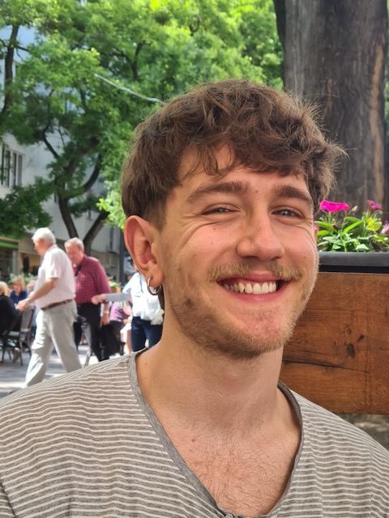

+++
title = "About"

extra.in_header = true
+++

Hello! 👋 My name is Alex and I am a graduate student in computer science, currently located in Barcelona for an exchange semester.

## Professional

Over the past two years, I have been delving into theoretical computer science at TU Wien, especially into algorithms and computational complexity. I find computation as a concept to be quite alluring, as it seems to me as if it is still not very well understood.

Before my current endeavors, I have been working as a data scientist at a Viennese startup called XUND, working on language models that extract information from medical data. In parallel, I was pursuing my Bachelor's degree in Artificial Intelligence at JKU Linz.

## Personal

Overall, simple things, like discovering new music or coffee, are what appeal to me in my spare time. Besides that, I go to the gym, read a book from time to time, and try to keep in touch with friends and family. To finish, I leave you with some of my favorite albums.

<iframe style="border: 0; width: 100%; height: 120px;" src="https://bandcamp.com/EmbeddedPlayer/album=2422513439/size=large/bgcol=181a1b/linkcol=056cc4/tracklist=false/artwork=small/transparent=true/" seamless><a href="https://floatingpoints.bandcamp.com/album/crush">Crush by Floating Points</a></iframe>

<iframe style="border: 0; width: 100%; height: 120px;" src="https://bandcamp.com/EmbeddedPlayer/album=2146782469/size=large/bgcol=181a1b/linkcol=056cc4/tracklist=false/artwork=small/transparent=true/" seamless><a href="https://russiancircles.bandcamp.com/album/gnosis">Gnosis by Russian Circles</a></iframe>

<iframe style="border: 0; width: 100%; height: 120px;" src="https://bandcamp.com/EmbeddedPlayer/album=2705349552/size=large/bgcol=181a1b/linkcol=056cc4/tracklist=false/artwork=small/transparent=true/" seamless><a href="https://horselords.bandcamp.com/album/comradely-objects-2">Comradely Objects by Horse Lords</a></iframe>
